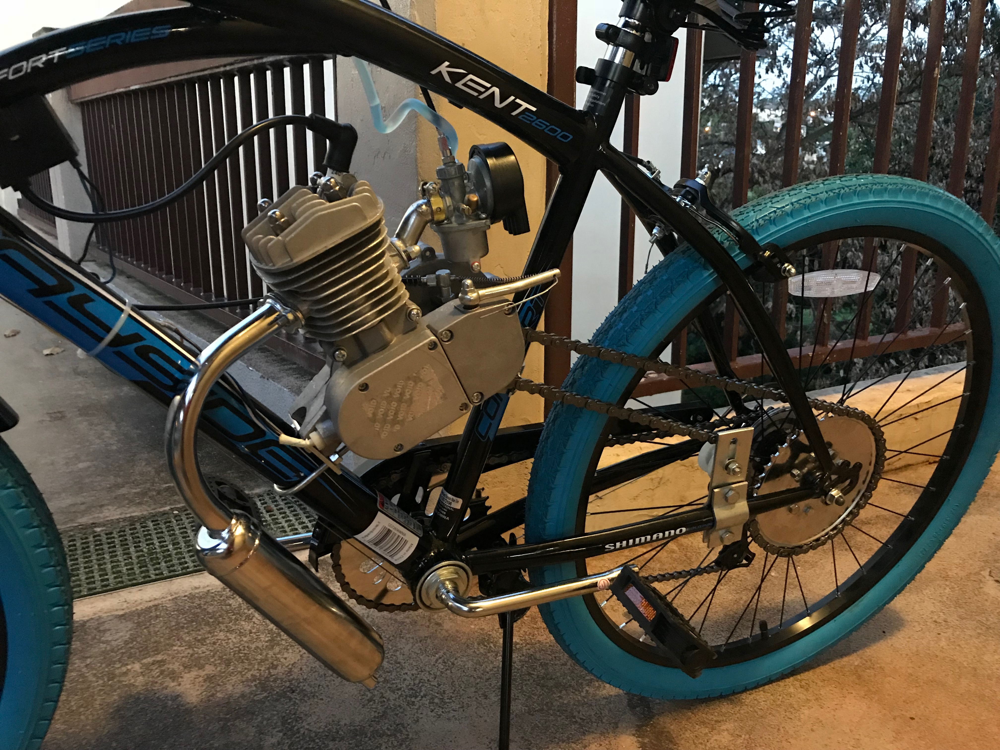
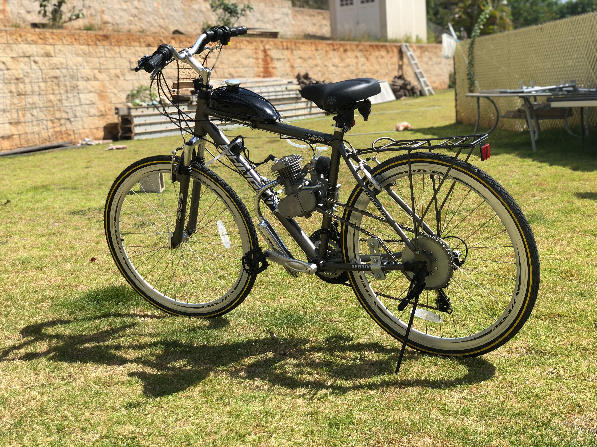
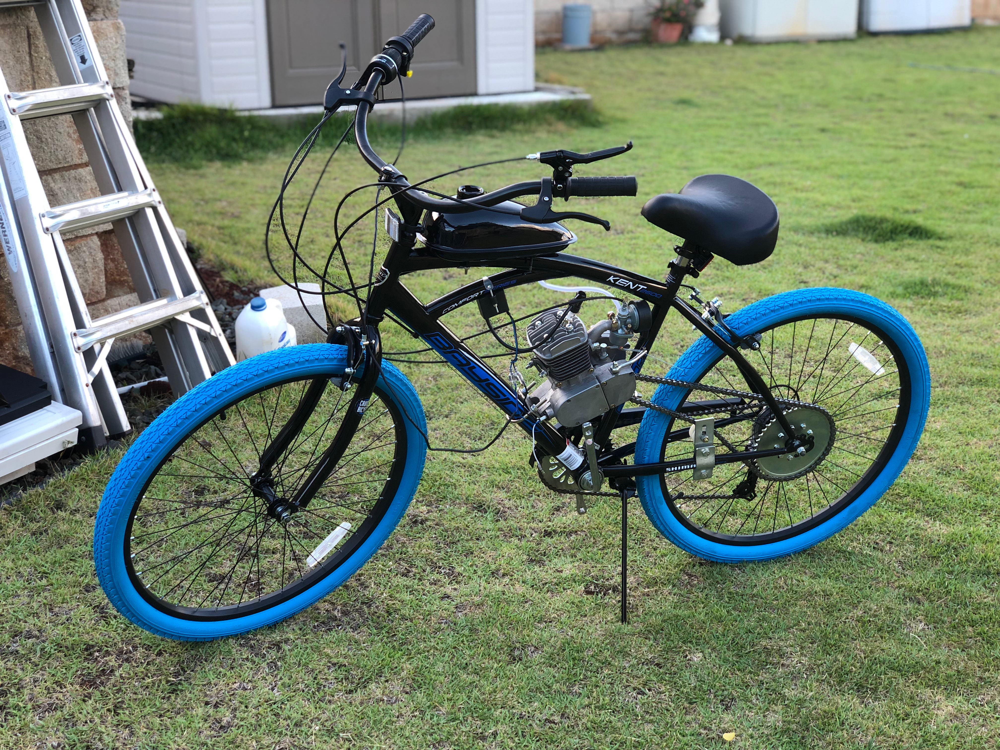
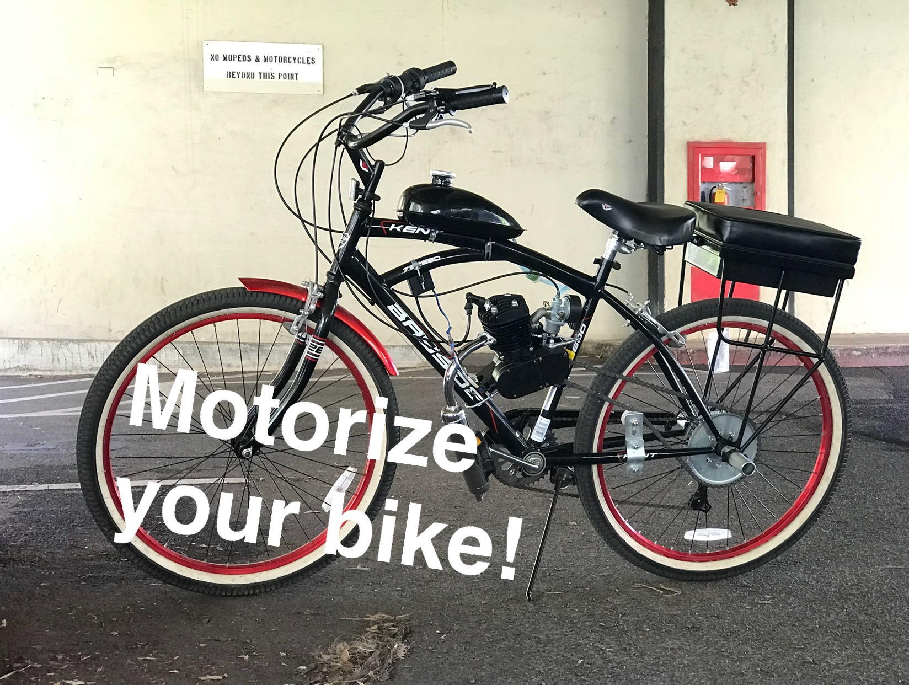

  
  
  
  

Over the summer I started a bike-building business for people interested in coverting their existing bicycles into motorized modes of transportation. I have had a year of experience building these bikes from the time I started taking orders and making money off of my builds. Building the bikes were very simple, but were also very time-consuming. With the process being so straightforward: mounting the sprocket onto the back wheel, mounting the motor and attaching the chain, then finally setting up the throttle and carburetor and exhaust manifolds was a very simple process. However, the process of fine tuning the bike to be safe to ride and to use on the street was a more complicated procedeure.

There were countless times where the parts I ordered online were not machined properly, had poor production quality, or were outright defective right out of the packaging it came in. Mounting sprockets that would not sit cenetered on the hub of the rear wheel, assembling carburetors that were not correctly made before shipping, and fine tuning the clutch and intake systems of the engine before finally presenting the finished product to my customers took the most time out of the process.

