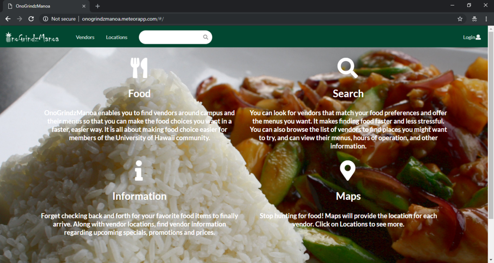
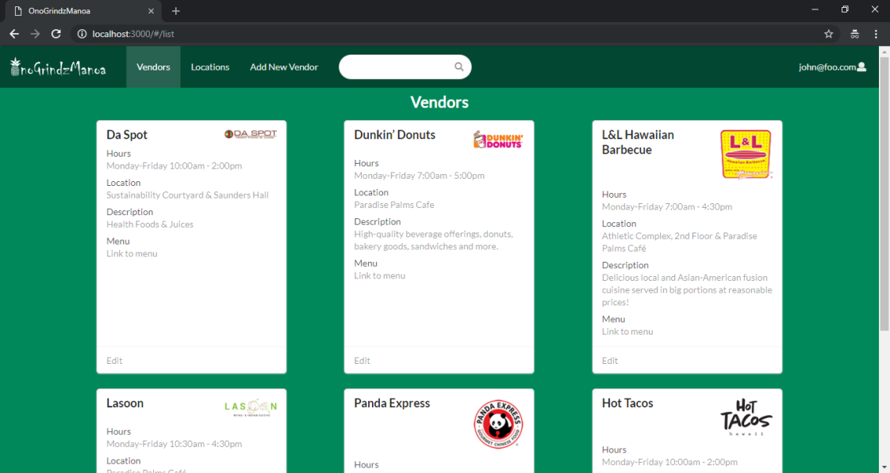
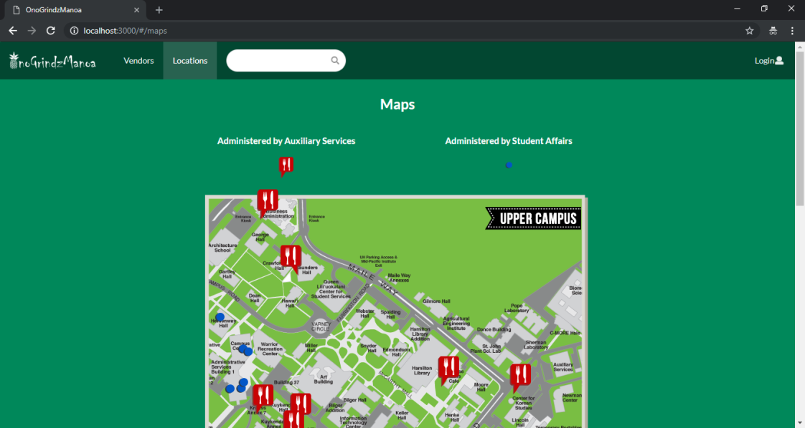

  
  
  

In Professor Johnson's ICS 314 course (Software Engineering), the final project we were assigned required us to create a website that would benefit the UH Community. With various ideas in mind, we settled on creating a website that would assist others in finding on campus. The website is called Onogrindzmanoa. In a nutshell, our vision for the website was to have users be able to view the location of various food venders on the UH Manoa campus while also being able to view the details associated with any of those vendors. Conversely, vendors would be able to add and delete infomration on the website as necessary.

Working on the project with the group assigned to me really gave me an immersive experience in project management. Using Github as the platform to manage our project milestones and assign a wide range of issues to each group member enabled us to stay on track and on schedule when developing our website. There were three milestones in total, and after completing each milestone the website became more refined and complete. Page ideas went from mockups to functioning components and designs in a matter of weeks. One of the most important takeaways I received from participating in this group project was being able to quantify and view the work I had developed and produced throughout taking ICS 314.

